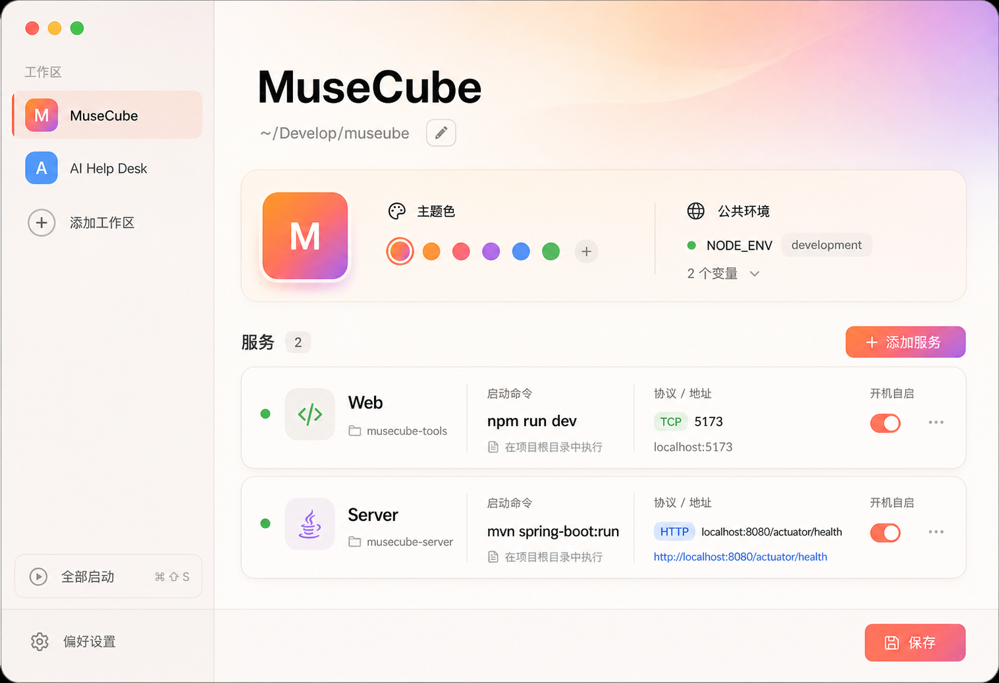

# DevBar 设计规格

日期：2026-07-28

状态：已由用户确认

## 1. 产品定义

DevBar 是一款个人使用的 macOS 菜单栏开发启动器。用户预先配置工作区、目录和 Shell 命令，然后在菜单栏中并行启动或停止本地 npm、Java 及其他命令行服务，并查看可信的运行状态与日志。

首版只面向当前用户的本机，不提供账号、云同步、配置导入导出、自动更新、公开分发或跨平台支持。

### 目标

- 从菜单栏一键启动或停止一个工作区中的多个服务。
- 不硬编码 npm、Java 等程序类型，所有服务统一作为受控 Shell 命令运行。
- 准确管理整个子进程组，避免只停止主进程后留下 npm、Java 等派生进程。
- 通过可选 HTTP/TCP 健康检查区分“进程存在”和“服务就绪”。
- 在独立窗口中查看实时及最近一次运行日志。
- 通过纯 GUI 创建和维护本机配置。

### 首版不做

- DevBar 或工作区服务的开机自启、登录启动。
- 服务依赖编排、固定启动延时、自动重启、自定义停止脚本。
- 快捷键、通知中心、配置文件导入导出、密钥保存。
- App Sandbox、Mac App Store、Developer ID 公证、自动更新。
- 深色视觉主题；首版固定使用已确认的暖色浅色主题。

## 2. 核心体验

### 菜单栏面板

状态栏图标汇总所有服务状态：

- 中性：全部停止。
- 黄色：存在启动中或未就绪服务。
- 绿色：所有已启动服务均正常运行或已就绪。
- 红色提示点：存在启动失败、异常退出、配置错误或日志写入错误。

点击图标打开窗口式面板。面板顶部显示 DevBar 和设置入口；主体为可滚动的工作区卡片。每张卡片包含：

- 工作区名称和汇总状态。
- “启动全部”或“停止全部”操作。
- 服务名称、状态、单独启停按钮和日志入口。

“启动全部”只并行启动 `includeInStartAll = true` 且当前已停止的服务。已启动、正在启动或正在停止的服务不重复执行。某个服务失败只影响自身，其他服务继续运行。

### 设置窗口

设置窗口采用“工作区侧栏 + 服务卡片”结构：

- 左侧选择、新增、排序和删除工作区。
- 右侧展示工作区基础信息、公共环境摘要与服务卡片。
- 点击服务卡片后使用 Sheet 编辑完整服务字段。
- 设置窗口只负责配置，不提供“全部启动”入口。
- 运行中的服务禁止修改执行配置，必须先停止。

工作区根目录必填。服务默认选择根目录下的子目录，并以相对路径保存；也允许选择根目录外的绝对目录。

配置页使用“检查配置”而不是“测试命令”。检查配置验证目录、环境变量名和健康检查参数，并执行两项安全 Shell 检查：用 `-n -c` 检查命令语法；用 `-lic 'exit 0'` 探测登录 Shell 初始化，最多等待 5 秒。它不执行真实服务命令。

### 日志窗口

日志使用独立窗口，并提供：

- 工作区和服务选择。
- stdout/stderr 区分显示。
- 搜索、暂停自动滚动、清空当前视图。
- 打开日志目录。
- 删除历史日志时单独确认。

清空视图不删除轮转文件。界面内存中每个服务保留最近 2,000 行；文件按每个服务 5 MiB × 3 个文件轮转。

### 退出行为

DevBar 不提供任何开机自启功能。用户手动打开应用，服务也只由用户手动启动。

显式退出时如果仍有服务运行，应用列出运行中的服务并要求确认。确认后完成分级停止再退出；取消则保持应用和服务运行。

## 3. 视觉规范

已选择的视觉基准：

视觉稿只作为风格和信息层级基准，以下内容必须按产品语义修正：

- 视觉稿中的“开机自启”改为“加入启动全部”。
- 设置侧栏中的“全部启动”删除，启动操作保留在菜单栏面板。
- 环境变量概览只显示数量，不直接铺开变量值。

首版视觉方向：

- 暖珍珠白与浅沙色基础背景。
- 珊瑚橙 → 粉红 → 淡紫渐变只用于工作区标识、选中态和主要按钮。
- 主要容器圆角 18–22 pt，控件圆角 10–12 pt。
- 阴影只用于窗口、弹层和主要服务对象；普通行使用留白、对齐和浅分隔线建立层级。
- 使用系统 SF Pro 字体与 SF Symbols，不使用 Emoji 或自绘图标替代系统图标。
- 主文本保持深灰高对比，渐变区域上的文字必须满足可读性要求。
- 避免卡片套卡片、全屏渐变、每一行都加阴影、过多胶囊标签和网页化的居中大卡片。

建议初始窗口尺寸：

- 菜单栏面板：380 × 520 pt，可随工作区数量纵向滚动。
- 设置窗口：980 × 680 pt，最小 820 × 560 pt。
- 日志窗口：900 × 600 pt，最小 720 × 440 pt。

## 4. 配置模型

配置文件使用 schema version 1。稳定 ID 使用 UUID，用户可见排序使用数组顺序。

### AppConfig

- `schemaVersion: Int`，首版固定为 `1`。
- `workspaces: [WorkspaceConfig]`。
- `preferences: PreferencesConfig`。

### WorkspaceConfig

- `id: UUID`。
- `name: String`，必填且去除首尾空白。
- `rootDirectory: String`，标准化后的绝对路径，必填。
- `iconSymbol: String`，来自允许的 SF Symbols 集合。
- `tintHex: String`，来自预设主题色，不接受任意透明色。
- `environment: [EnvironmentEntry]`，公共普通环境变量。
- `services: [ServiceConfig]`，数组顺序即展示顺序。

### ServiceConfig

- `id: UUID`。
- `name: String`，必填。
- `workingDirectory: WorkingDirectory`：
  - `relative(path)`：相对工作区根目录。
  - `absolute(path)`：工作区根目录外的绝对目录。
- `command: String`，必填，由用户信任并明确配置的 Shell 命令。
- `includeInStartAll: Bool`，默认 `true`。
- `environment: [EnvironmentEntry]`，覆盖同名工作区变量。
- `healthCheck: HealthCheckConfig`。

### EnvironmentEntry

- `key: String`，必须匹配 `[A-Za-z_][A-Za-z0-9_]*`。
- `value: String`。

环境变量按“登录 Shell 环境 → 工作区变量 → 服务变量”合并，后者覆盖前者。应用不记录合并后的完整环境，也不在日志中输出变量值。首版不允许把密码、令牌或密钥保存为环境变量。

### HealthCheckConfig

- `none`：进程稳定存活即视为运行中。
- `http(url)`：只接受 HTTP 200–399。
- `tcp(host, port)`：成功建立 TCP 连接即通过。

健康检查间隔 2 秒，单次超时 1 秒，同一服务不并发执行检查。持续失败时保持进程运行并标记“未就绪”，不自动停止或重启。

### PreferencesConfig

- `shellPath: String?`：默认读取 `$SHELL`，首版只接受可执行的 zsh 或 bash；缺失或不支持时回退 `/bin/zsh` 并提示。
- `logFileSizeMiB: Int`：首版固定默认值 `5`。
- `logFileCount: Int`：首版固定默认值 `3`。
- `sigintGraceSeconds: Int`：首版固定默认值 `8`。
- `sigtermGraceSeconds: Int`：首版固定默认值 `3`。

不存在登录启动或服务自动启动字段。

## 5. 技术架构

技术栈为 Swift 6、SwiftUI 与少量 AppKit，最低部署目标 macOS 15。应用使用窗口式 `MenuBarExtra`，无常驻 Dock 图标；打开设置或日志时显示正常窗口。

主要组件：

- `WorkspaceStore`：配置加载、校验、排序、迁移和原子保存。
- `ProcessSupervisor`：服务状态机、启动请求幂等、Runner 生命周期和工作区并行操作。
- `DevBarRunner`：每个运行服务一个轻量辅助进程，创建独立 Shell 进程组、转发 stdout/stderr、执行分级停止并监控 GUI 控制通道。
- `HealthChecker`：HTTP/TCP 检查和就绪状态。
- `LogStore`：内存缓冲、文件轮转、搜索数据源和历史日志定位。
- `AppState`：把上述组件暴露的只读状态组合给 SwiftUI，不承载进程或持久化实现。

组件使用稳定 UUID 通信，不直接读取彼此内部存储。

## 6. 进程与 Shell 生命周期

### 启动

1. `ProcessSupervisor` 验证当前状态为已停止，并创建本次运行 ID。
2. 启动 `DevBarRunner`，建立独立控制通道和 stdout/stderr 管道。
3. Runner 使用已校验的 zsh 或 bash；默认 `$SHELL`，不支持时回退 `/bin/zsh`。
4. Runner 使用 `-l -i -c <command>` 执行用户命令，以兼容 Homebrew、nvm、SDKMAN 等常见登录 Shell 环境。
5. Runner 通过 `posix_spawn` 为 Shell 建立独立进程组。
6. GUI 收到已生成进程事件后进入启动中；无健康检查时进程连续存活 1 秒进入运行中，有健康检查时检查通过进入已就绪。

无 TTY 的 Shell 初始化错误、命令不存在、目录不可访问和退出码都写入服务日志并呈现在失败原因中。

### 状态机

服务状态固定为：

`stopped → starting → running/ready/unready → stopping → stopped`

进程启动失败或非零异常退出进入 `failed`。从 `failed` 可重新启动；重新启动创建新的运行 ID。过期运行 ID 的事件必须丢弃，避免旧异步回调覆盖新状态。

### 停止

Runner 对 Shell 进程组执行：

1. 发送 `SIGINT`，等待最多 8 秒。
2. 仍存活则发送 `SIGTERM`，等待最多 3 秒。
3. 仍存活则发送 `SIGKILL`。

每一步和最终结果都写入日志。停止操作幂等，正在停止时重复点击不产生额外信号序列。

### 崩溃防残留

GUI 与每个 Runner 之间保持专用控制通道。GUI 崩溃、被强制结束或控制通道异常关闭时，Runner 将其视为所有权丢失，立即执行同一分级停止流程并在确认子进程组退出后结束自身。

应用重启时不认领任意旧 PID，也不根据可能复用的 PID 自动杀进程。

## 7. 持久化与文件位置

配置保存在：

`~/Library/Application Support/DevBar/config.json`

日志保存在：

`~/Library/Application Support/DevBar/Logs/<workspace-id>/<service-id>/`

配置保存流程为：编码到同目录临时文件、同步写入、把上一份有效配置保留为 `config.json.bak`、替换正式文件。配置文件权限为当前用户读写。解析失败时保留损坏文件副本并加载 `.bak`；没有有效备份时进入空配置并明确提示，不静默覆盖。

运行状态不写入配置文件。

## 8. 安全边界

- Shell 命令属于用户明确配置的本机可信代码；应用不从网络下载或自动拼接命令。
- 环境变量键必须校验，变量值不写入日志。
- 首版不保存密码、令牌或密钥；需要敏感变量时由用户的 Shell 环境提供。
- 目录只通过系统目录选择器选择或由已有配置加载。
- 应用不启用 App Sandbox，因此不能以 Mac App Store 版本为交付目标。
- 删除工作区或服务只删除 DevBar 配置与对应日志，不删除项目目录或项目文件。

## 9. 错误处理

- 配置错误：阻止保存并在具体字段附近显示原因。
- “检查配置”的 Shell 初始化探测超过 5 秒：阻止保存并提示检查 `.zshrc` 或 `.bashrc` 中依赖 TTY、等待输入的逻辑。
- 进程异常退出：记录退出码和最后错误输出，状态设为失败。
- 健康检查失败：状态设为未就绪并显示最近错误，不停止进程。
- 部分启动失败：仅失败服务进入失败状态，其他服务继续运行。
- 日志写入失败：保留内存日志并显示一次非阻塞警告，不停止服务。
- 配置文件损坏：恢复备份并提示用户，不静默丢失。
- 根目录或服务目录移动：卡片显示目录失效，禁止启动，允许重新选择目录。

## 10. 测试与验收

### 单元测试

- 配置编码、解码、schema version 和损坏备份恢复。
- 工作区/服务字段校验、相对与绝对目录解析。
- zsh/bash 识别、命令语法检查和 5 秒登录 Shell 探测超时。
- 环境变量合并与覆盖，且日志不包含变量值。
- 服务状态机的合法迁移、重复启动/停止幂等和过期运行事件丢弃。
- 日志 5 MiB × 3 文件轮转与 2,000 行内存上限。
- HTTP 200–399、HTTP 失败、TCP 成功、TCP 超时和检查不重入。

### 集成测试

- 临时 Shell 脚本正常启动、输出 stdout/stderr 和正常退出。
- 脚本派生多个子进程时，对进程组分级停止后无残留。
- Runner 控制通道断开时清理整个子进程组。
- 命令不存在、目录不存在、Shell 配置输出错误和非零退出。
- 工作区多个服务并行启动，单个失败不影响其余服务。
- 显式退出确认后停止全部服务再退出。

### UI 测试

- 新增、编辑、排序和删除工作区。
- 新增服务、选择相对/绝对目录、检查配置和保存。
- 菜单栏工作区卡片的整组与单服务启停。
- 运行中禁止编辑执行配置。
- 查看、搜索、暂停、清空日志视图和打开日志目录。
- 不存在任何开机自启、登录启动或服务自动启动入口。

### 验收标准

在一台 Apple Silicon、macOS 26 的测试机上：

1. 创建一个根目录下包含 npm 与 Java 服务的工作区。
2. 从菜单栏并行启动两个服务，状态分别反映进程和健康检查结果。
3. 单独停止任意服务或停止整个工作区后，确认无派生进程残留。
4. 模拟 GUI 异常结束，确认 Runner 清理所有受管进程。
5. 重新打开应用后配置与历史日志可读取，但服务不会自动启动。
6. UI 与暖色渐变参考保持一致，同时修正视觉稿中的错误语义。
